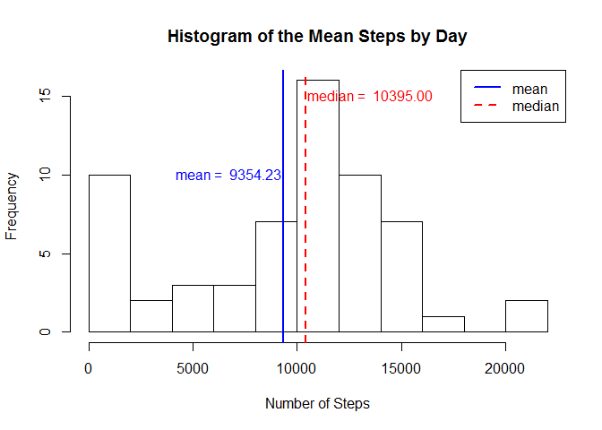
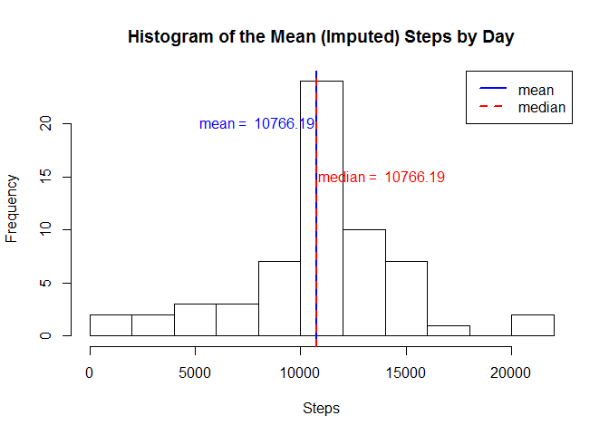
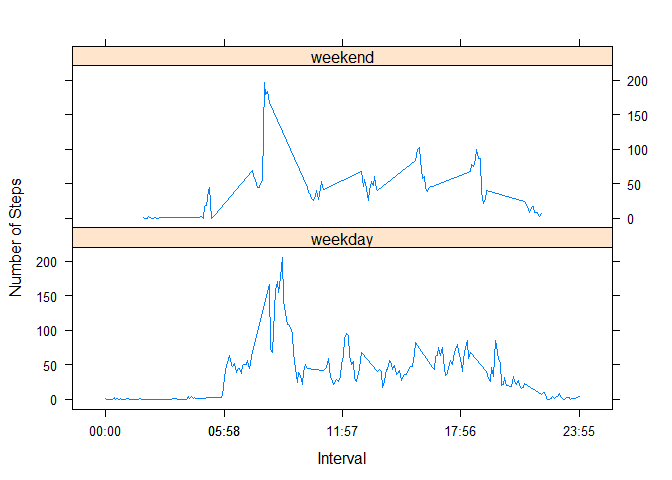

# Reproducible Research: Peer Assessment 1


## Loading and preprocessing the data

```r
activityData <- read.csv('activity/activity.csv', na.strings = "NA")
```


## What is mean total number of steps taken per day?

```r
activityDataByDay <- aggregate(activityData$steps, by=list(date = activityData$date), 
                               FUN=sum, na.rm = TRUE)
colnames(activityDataByDay)[2] <- 'steps'

hist(activityDataByDay$steps, main = "Histogram of the Mean Steps by Day", xlab='Steps')
legend("topright", c("mean", "median"), col=c("blue", "red"), lwd=2, lty=c(1,2))

meanStepsPerDay <- mean(activityDataByDay$steps, na.rm = TRUE)
abline(v = meanStepsPerDay, col = "blue", lwd = 2)
text(20, x=meanStepsPerDay, pos = 2, offset = 0.1, col = "blue",
     paste('mean = ', format(meanStepsPerDay, digits = 7)))

medianStepsPerDay <- median(activityDataByDay$steps, na.rm = TRUE)
abline(v = medianStepsPerDay, col = "red", lwd = 2, lty=2)
text(15, x=medianStepsPerDay, pos = 4, offset = 0.1, col = "red",
     paste('median = ', format(medianStepsPerDay, digits = 7)))
```

 

The mean is 9354.23 and the median is 10395.

## What is the average daily activity pattern?

```r
activityDataByInterval <- aggregate(activityData$steps, 
                                    by=list(interval = activityData$interval), 
                                    FUN=mean, na.rm = TRUE)
colnames(activityDataByInterval)[2] <- 'steps'

maxIntervalSteps <- max(activityDataByInterval$steps)
maxIntervalStepsIdx <- which.max(activityDataByInterval$steps) 
maxInterval <- activityDataByInterval$interval[maxIntervalStepsIdx]

plot(x = activityDataByInterval$interval, y = activityDataByInterval$steps, type="l",
      main = "Average Daily Activity", xlab = "Interval", ylab = "Steps")
abline(v = maxInterval, col = "blue", lwd = 2)
text(maxIntervalSteps, x=maxInterval, pos = 4, offset = 0.25, col = "blue",
     paste('max steps interval = ', format(maxInterval, digits = 7)))
```

 

The max number of steps is 206.17 at interval, 835.

## Imputing missing values
Number of rows with missing values:

```r
length(is.na(activityData$steps))
```

```
## [1] 17568
```

Replace NA values with average daily interval values.

```r
library(dplyr)
```

```
## 
## Attaching package: 'dplyr'
## 
## The following object is masked from 'package:stats':
## 
##     filter
## 
## The following objects are masked from 'package:base':
## 
##     intersect, setdiff, setequal, union
```

```r
activityDataByInterval <- aggregate(activityData$steps, 
                                    by=list(interval = activityData$interval), 
                                    FUN=mean, na.rm = TRUE)
colnames(activityDataByInterval)[2] <- 'meanSteps'

activityData2 <- merge(activityData, activityDataByInterval, by="interval")
activityData2 <- mutate(activityData2, imputedSteps = ifelse(is.na(steps), meanSteps, steps))
```

Plot histogram.

```r
activityDataByDay2 <- aggregate(activityData2$imputedSteps, 
                               by=list(date = activityData2$date), 
                               FUN=sum)
colnames(activityDataByDay2)[2] <- 'steps'

hist(activityDataByDay2$steps, main = "Histogram of the Mean (Imputed) Steps by Day", xlab='Steps')
legend("topright", c("mean", "median"), col=c("blue", "red"), lwd=2, lty=c(1,2))

meanStepsPerDay <- mean(activityDataByDay2$steps)
abline(v = meanStepsPerDay, col = "blue", lwd = 2)
text(20, x=meanStepsPerDay, pos = 2, offset = 0.1, col = "blue",
     paste('mean = ', format(meanStepsPerDay, digits = 7)))

medianStepsPerDay <- median(activityDataByDay2$steps)
abline(v = medianStepsPerDay, col = "red", lwd = 2, lty=2)
text(15, x=medianStepsPerDay, pos = 4, offset = 0.1, col = "red",
     paste('median = ', format(medianStepsPerDay, digits = 7)))
```

 

The mean is 10766.19 and the median is 10766.19. The main difference between the Imputed data and the data with "NA" omitted is that mean and median for the Imputed data is the same.  

## Are there differences in activity patterns between weekdays and weekends?

```r
library(lubridate)
```

```
## Warning: package 'lubridate' was built under R version 3.2.1
```

```r
isWeekday <- function(d) {
  day <- weekdays(as.Date(d, format="%Y-%m-%d"))

  if (day == "Saturday" || day == "Sunday") {
    return("weekend")
  } else {
    return("weekday")
  }
}

activityData2$dayType = sapply(activityData$date, isWeekday)

library(lattice) 
xyplot(activityData2$imputedSteps~activityData2$interval|activityData2$dayType, 
   ylab="Number of Steps", xlab="Interval", type="l",
   layout = c(1,2))
```

 
